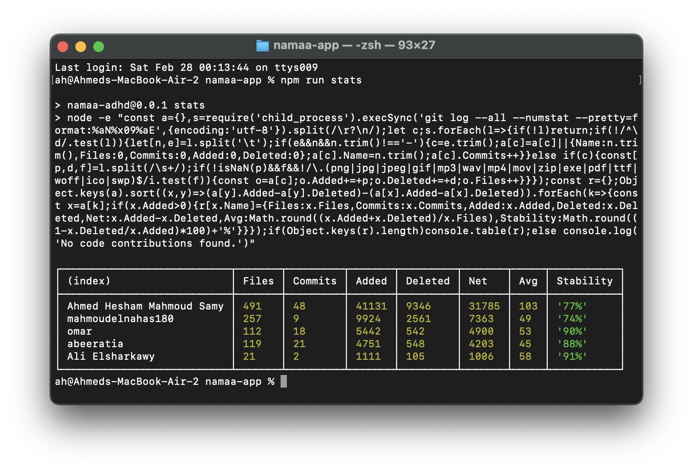

# 📊 Local Git Insights (Free GitHub Insights Alternative)


**Local Git Insights** is a high-performance, zero-dependency analytics engine designed to extract deep repository metrics directly from your Git history. It serves as a lightweight, privacy-focused alternative to GitHub's premium "Insights" feature.

---

## 🖼️ Preview

See your team's performance at a glance directly in your terminal:



---

## 💡 Why This Tool?

GitHub locks advanced contributor statistics behind a paywall for private repositories. This tool solves that by leveraging the power of `git log` and Node.js:

* **Cost Efficiency:** Get "GitHub Team" level insights for $0/month.
* **Privacy First:** No data ever leaves your machine. Perfect for sensitive corporate codebases.
* **Data Integrity:** Automatically filters out noise (binaries, lockfiles, assets) to ensure metrics reflect actual logic changes.
* **Identity Resolution:** Intelligently merges contributions from users using multiple aliases or emails.

---

## 🚀 Installation & Usage

### Option 1: The Standalone CLI (Cleanest)

Since you already have the file in your repo, just run:

```bash
node git-stats.js

```

### Option 2: The "Instant" One-Liner

Run this in **any** other Git repository on your machine to generate an immediate report without copying any files:

```bash
node -e 'const a={},s=require("child_process").execSync("git log --all --numstat --pretty=format:%aN%x09%aE",{encoding:"utf-8"}).split(/\r?\n/);let c;s.forEach(l=>{if(!l)return;if(!/^\d/.test(l)){let[n,e]=l.split("\t");if(e&&n&&n.trim()!=="-"){c=e.trim();a[c]=a[c]||{Name:n.trim(),Files:0,Commits:0,Added:0,Deleted:0};a[c].Name=n.trim();a[c].Commits++}}else if(c){const[p,d,f]=l.split(/\s+/);if(!isNaN(p)&&f&&!/\.(png|jpg|jpeg|gif|mp3|wav|mp4|mov|zip|exe|pdf|ttf|woff|ico|swp)$/i.test(f)){const o=a[c];o.Added+=+p;o.Deleted+=+d;o.Files++}}});const r={};Object.keys(a).sort((x,y)=>(a[y].Added-a[y].Deleted)-(a[x].Added-a[x].Deleted)).forEach(k=>{const x=a[k];if(x.Added>0){r[x.Name]={Files:x.Files,Commits:x.Commits,Added:x.Added,Deleted:x.Deleted,Net:x.Added-x.Deleted,Avg:Math.round((x.Added+x.Deleted)/x.Files),Stability:Math.round((1-x.Deleted/x.Added)*100)+"%"}}});if(Object.keys(r).length)console.table(r);else console.log("No code contributions found.")'

```

### Option 3: Via `package.json` (Recommended for Teams)

Add this script to your `package.json` to make it accessible to everyone on your team.

```json
"scripts": {
  "stats": "node -e \"const a={},s=require('child_process').execSync('git log --all --numstat --pretty=format:%aN%x09%aE',{encoding:'utf-8'}).split(/\\r?\\n/);let c;s.forEach(l=>{if(!l)return;if(!/^\\d/.test(l)){let[n,e]=l.split('\\t');if(e&&n&&n.trim()!=='-'){c=e.trim();a[c]=a[c]||{Name:n.trim(),Files:0,Commits:0,Added:0,Deleted:0};a[c].Name=n.trim();a[c].Commits++}}else if(c){const[p,d,f]=l.split(/\\s+/);if(!isNaN(p)&&f&&!/\\.(png|jpg|jpeg|gif|mp3|wav|mp4|mov|zip|exe|pdf|ttf|woff|ico|swp)$/i.test(f)){const o=a[c];o.Added+=+p;o.Deleted+=+d;o.Files++}}});const r={};Object.keys(a).sort((x,y)=>(a[y].Added-a[y].Deleted)-(a[x].Added-a[x].Deleted)).forEach(k=>{const x=a[k];if(x.Added>0){r[x.Name]={Files:x.Files,Commits:x.Commits,Added:x.Added,Deleted:x.Deleted,Net:x.Added-x.Deleted,Avg:Math.round((x.Added+x.Deleted)/x.Files),Stability:Math.round((1-x.Deleted/x.Added)*100)+'%'}}});if(Object.keys(r).length)console.table(r);else console.log('No code contributions found.')\""
}

```

Run it anytime using:

```bash
npm run stats

```

---

## 📊 Metric Definitions

| Metric | Definition | Engineering Insight |
| --- | --- | --- |
| **Files** | Unique files modified | Measures the "Surface Area" of a dev's knowledge. |
| **Net** | Added lines - Deleted lines | Total code footprint remaining in the project. |
| **Avg** | (Added + Deleted) / Files | Measures the "Intensity" of changes per file. |
| **Stability** | $1 - (Deleted / Added)$ | Indicates how much code survived refactoring. |

---

## ⚙️ Configuration

The engine is pre-configured to ignore non-code assets. To add more extensions (like `.min.js` or `package-lock.json`), open [git-stats.js](./git-stats.js) and update the exclusion regex.

---

## 🛠 Prerequisites

* [Git](https://git-scm.com/)
* [Node.js](https://nodejs.org/) (Version 12 or higher)

## 📄 License

This project is licensed under the **MIT License**. See the [LICENSE](./LICENSE) file for details.

---

**Developed with ❤️ by [Ahmed Hesham Mahmoud Samy](https://github.com/AhmedE404).**
